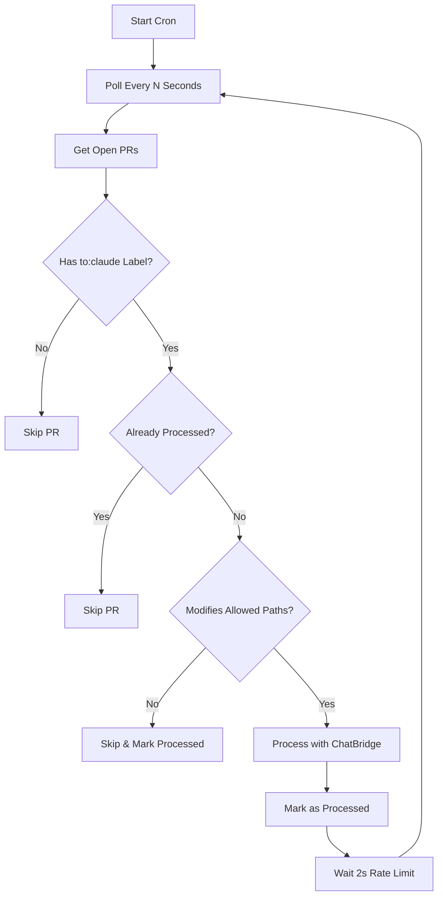

# Cron Fallback for Operator

**Last Updated**: 2025-09-06  
**Version**: 1.0.0  
**Purpose**: Backup polling mechanism when webhooks are unavailable

## Overview
The cron fallback provides a polling-based alternative to webhooks, checking for PRs with the `to:claude` label at regular intervals.

## When to Use

### Primary Use Cases
- Webhook server is down for maintenance
- GitHub webhook deliveries are failing
- Testing/development without webhook setup
- Backup redundancy for critical messages

### Not Recommended For
- High-volume processing (use webhooks)
- Real-time requirements (30-60s delay)
- Production primary mechanism

## Configuration

### Environment Variables

| Variable | Default | Description |
|----------|---------|-------------|
| `POLL_INTERVAL` | `60000` | Polling interval in milliseconds |
| `ENABLE_CRON` | `true` | Set to `false` to disable |
| `HEALTH_PORT` | - | Optional port for health endpoint |
| `GITHUB_APP_ID` | Required | GitHub App ID |
| `GITHUB_INSTALLATION_ID` | Required | Installation ID |
| `GITHUB_PRIVATE_KEY` | Required | Base64 encoded private key |

### Polling Intervals

Recommended settings by use case:

| Use Case | Interval | ENV Value |
|----------|----------|-----------|
| Development | 30 seconds | `30000` |
| Testing | 1 minute | `60000` |
| Production backup | 2 minutes | `120000` |
| Low priority | 5 minutes | `300000` |

## Running the Cron Worker

### Local Development
```bash
cd tooling/operator
npm install
npm run build

# Set environment
export POLL_INTERVAL=30000
export ENABLE_CRON=true

# Start cron worker
npm run start:cron
```

### Docker Deployment
```dockerfile
FROM node:18-alpine
WORKDIR /app
COPY tooling/operator/package*.json ./
RUN npm ci --only=production
COPY tooling/operator/dist ./dist
CMD ["npm", "run", "start:cron"]
```

### Render Background Worker
```yaml
# render.yaml
services:
  - type: worker
    name: operator-cron
    env: node
    rootDir: tooling/operator
    buildCommand: npm install && npm run build
    startCommand: npm run start:cron
    envVars:
      - key: POLL_INTERVAL
        value: 120000
      - key: ENABLE_CRON
        value: true
```

### GitHub Actions Schedule
```yaml
name: Cron Fallback
on:
  schedule:
    # Run every 5 minutes
    - cron: '*/5 * * * *'
  workflow_dispatch:

jobs:
  poll-prs:
    runs-on: ubuntu-latest
    steps:
      - uses: actions/checkout@v3
      
      - name: Setup Node
        uses: actions/setup-node@v3
        with:
          node-version: '18'
      
      - name: Install and Build
        run: |
          cd tooling/operator
          npm ci
          npm run build
      
      - name: Run Polling
        env:
          GITHUB_APP_ID: ${{ secrets.APP_ID }}
          GITHUB_INSTALLATION_ID: ${{ secrets.INSTALLATION_ID }}
          GITHUB_PRIVATE_KEY: ${{ secrets.APP_PRIVATE_KEY }}
          POLL_INTERVAL: 1000  # Run once
          ENABLE_CRON: false    # Single run mode
        run: |
          cd tooling/operator
          node dist/cron.js
```

## How It Works

### Processing Flow


### Idempotency Features

1. **Session Memory**: Tracks processed PRs during runtime
2. **PR Deduplication**: Won't reprocess same PR in session
3. **ChatBridge Integration**: Uses existing idempotency checks
4. **Rate Limiting**: 2-second delay between PR processing

## Monitoring

### Health Check Endpoint
When `HEALTH_PORT` is set:
```bash
# Start with health endpoint
export HEALTH_PORT=3001
npm run start:cron

# Check health
curl http://localhost:3001/health
```

Response:
```json
{
  "ok": true,
  "mode": "cron",
  "interval": 60000,
  "processed": [42, 43, 44]
}
```

### Logging

Normal operation:
```
🚀 Starting Cron Worker
   Polling interval: 60000ms
   Monitoring: PRs with 'to:claude' label
🔍 Polling for PRs with to:claude label...
  📬 Found 2 PRs to process
  🔄 Processing PR #42: Chat message
  ✅ PR #42 processed successfully
```

No PRs found:
```
🔍 Polling for PRs with to:claude label...
  📭 No PRs with to:claude label found
```

Errors:
```
🔍 Polling for PRs with to:claude label...
  ❌ Failed to process PR #42: [error details]
❌ Polling error: [error details]
```

## Performance Considerations

### API Rate Limits
- GitHub API: 5000 requests/hour
- Each poll uses ~2-3 API calls
- At 1-minute intervals: ~180 calls/hour
- Safe margin maintained

### Resource Usage
- Memory: ~50-100MB
- CPU: Minimal (spikes during processing)
- Network: Light (API calls only)

### Scaling Limits
| PRs/Hour | Min Interval | Notes |
|----------|--------------|-------|
| 10 | 60s | Comfortable |
| 30 | 30s | Good performance |
| 60 | 30s | Near limit |
| 100+ | - | Use webhooks instead |

## Comparison with Webhooks

| Aspect | Webhooks | Cron Fallback |
|--------|----------|---------------|
| Latency | <1 second | 30-120 seconds |
| Reliability | Depends on server | Very reliable |
| Resource Usage | Minimal | Constant polling |
| Setup Complexity | Medium | Low |
| Scalability | Excellent | Limited |
| Best For | Production | Backup/Development |

## Troubleshooting

### Problem: Not Finding PRs
**Check**:
1. PRs have `to:claude` label
2. PRs are in "open" state
3. GitHub token has correct permissions

### Problem: Duplicate Processing
**Solutions**:
1. Increase `POLL_INTERVAL`
2. Check webhook isn't also running
3. Verify idempotency in ChatBridge

### Problem: High API Usage
**Solutions**:
1. Increase polling interval
2. Implement caching layer
3. Switch to webhooks for production

### Problem: Memory Growth
**Check**:
1. `processedPRs` Set size
2. Clear set periodically (after 1000 entries)
3. Check for memory leaks in ChatBridge

## Best Practices

### 1. Use as Backup Only
```javascript
// Primary: Webhook
// Fallback: Cron with longer interval
POLL_INTERVAL=300000  // 5 minutes for backup
```

### 2. Monitor Both Systems
- Set up alerts for webhook failures
- Monitor cron health endpoint
- Log all processing to identify gaps

### 3. Gradual Rollout
1. Start with webhook only
2. Add cron with long interval (5 min)
3. Reduce interval if webhooks fail
4. Return to webhook when stable

### 4. Clear Session State
For long-running workers:
```javascript
// Clear processed set every 24 hours
setInterval(() => {
  processedPRs.clear();
  console.log('🧹 Cleared processed PR cache');
}, 24 * 60 * 60 * 1000);
```

## Deployment Options Comparison

| Platform | Setup Difficulty | Cost | Reliability |
|----------|-----------------|------|-------------|
| GitHub Actions | Easy | Free (2000 min/mo) | High |
| Render Worker | Easy | $7/mo | High |
| VPS Cron | Medium | $5/mo | Medium |
| Local Machine | Easy | Free | Low |
| Docker Swarm | Hard | Varies | Very High |

## Migration Path

### From Cron to Webhooks
1. Deploy webhook server
2. Keep cron running (increase interval)
3. Monitor both for 24 hours
4. Verify webhook processes all PRs
5. Disable cron (`ENABLE_CRON=false`)
6. Keep cron code for emergencies

### Emergency Fallback
If webhooks fail:
1. Set `POLL_INTERVAL=30000`
2. Start cron worker immediately
3. Investigate webhook issues
4. Return to webhooks when fixed

---

**Remember**: Cron is a fallback mechanism. For production, use webhooks with cron as backup only.