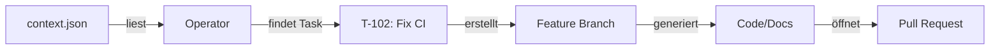

# 🎓 MCP & Operator Agent - Einfach Erklärt

**Für**: Einsteiger in MCP und unser AI-Kollaborationssystem  
**Datum**: 2025-09-03  
**Autor**: Claude

---

## 📚 Was ist das hier eigentlich?

Stell dir vor, du hast mehrere KI-Assistenten (Claude, ChatGPT, etc.), die zusammen an einem Projekt arbeiten sollen - wie ein virtuelles Team. Aber wie kommunizieren sie miteinander? Wie teilen sie Aufgaben auf? Das ist unser System!

### Die Grundidee in 3 Sätzen:
1. **GitHub = Gemeinsames Büro**: Alle KIs und Menschen arbeiten im gleichen GitHub Repository
2. **context.json = Aufgabenliste**: Eine zentrale ToDo-Liste, die alle lesen und updaten können
3. **Operator = Automatischer Helfer**: Ein Programm, das Aufgaben aus der Liste nimmt und abarbeitet

---

## 🔧 Was ist MCP (Model Context Protocol)?

**MCP** ist wie eine "Brücke" zwischen Claude und externen Tools:

```
Claude (in deinem Browser) <--MCP--> GitHub API
```

### Analogie:
- **Ohne MCP**: Claude ist wie ein Mitarbeiter ohne Telefon - kann nur reden, aber nichts tun
- **Mit MCP**: Claude bekommt Werkzeuge - kann GitHub PRs erstellen, Dateien lesen, Code schreiben

### Konkret bei uns:
```javascript
// MCP Server läuft im Hintergrund
// Location: tooling/github-mcp/
// Gibt Claude diese Fähigkeiten:
- GitHub API Zugriff
- PRs erstellen/mergen  
- Branches verwalten
- Issues bearbeiten
```

---

## 🤖 Was macht der Operator Agent?

Der **Operator** ist ein automatisches Programm, das:
1. Die Aufgabenliste (`memory/context.json`) liest
2. Aufgaben für Claude findet
3. Diese automatisch abarbeitet
4. PRs erstellt

### Workflow Beispiel:



### Real-World Beispiel von heute:
1. **Task in context.json**: "T-102: Fix CI/CD workflow issues"
2. **Operator startet**: `node tooling/operator/dist/index.js`
3. **Automatisch passiert**:
   - Branch erstellt: `feat/fix-ci-cd-workflow-issues`
   - Datei generiert: `implementations/t-102.md`
   - PR geöffnet: #4
   - Status updated: todo → in_progress

---

## 📁 Die wichtigsten Dateien erklärt

### 1. **memory/context.json** - Das Gehirn
```json
{
  "tasks": [
    {
      "id": "T-103",
      "title": "Implement Operator Agent",
      "owner": "claude",        // Wer soll das machen?
      "status": "todo",          // todo/in_progress/completed
      "description": "..."
    }
  ]
}
```
**Zweck**: Zentrale Aufgabenliste - alle schauen hier rein

### 2. **tooling/github-mcp/** - Die GitHub-Verbindung
```
tooling/github-mcp/
├── src/index.ts          # MCP Server Code
├── .env                  # GitHub App Credentials
└── dist/index.js         # Kompilierter Server
```
**Zweck**: Verbindet Claude mit GitHub API

### 3. **tooling/operator/** - Der Automatisierer
```
tooling/operator/
├── src/index.ts          # Operator Logic
├── package.json          # Dependencies
└── dist/index.js         # Ausführbare Datei
```
**Zweck**: Automatische Task-Abarbeitung

### 4. **.claude/settings.json** - Claude Konfiguration
```json
{
  "mcpServers": {
    "github": {
      "command": "node",
      "args": ["tooling/github-mcp/dist/index.js"]
    }
  }
}
```
**Zweck**: Sagt Claude, welche Tools verfügbar sind

---

## 🚀 Wie funktioniert das Ganze zusammen?

### Schritt-für-Schritt was heute passiert ist:

#### 1. **MCP Server Check**
```bash
cd tooling/github-mcp
node test-token.js
# → Testet ob GitHub App funktioniert
```

#### 2. **Operator bauen**
```bash
cd tooling/operator
npm install           # Installiert Dependencies
npm run build         # TypeScript → JavaScript
```

#### 3. **Dry-Run Test**
```bash
npm test  # oder: node dist/index.js --dry-run
# → Zeigt was passieren WÜRDE, macht aber nichts
```

#### 4. **Produktiv-Lauf**
```bash
node dist/index.js
# → Liest context.json
# → Findet Task T-102
# → Erstellt automatisch PR #4
```

---

## 💡 Warum ist das cool?

### Ohne dieses System:
- Menschen müssen manuell Tasks verteilen
- KIs können nicht selbstständig arbeiten
- Keine Automatisierung möglich

### Mit diesem System:
- KIs arbeiten selbstständig Tasks ab
- Automatische PR-Erstellung
- Nachvollziehbare History in Git
- Multi-Agent Kollaboration möglich

---

## 🎯 Praktisches Beispiel: Was ist heute passiert?

1. **08:00** - CI/CD war kaputt (2 Tests rot)
2. **08:30** - Ich habe die CI repariert:
   - `.github/workflows/schema-validate.yml` angepasst
   - `.gitleaks.toml` für Secret-Scanning erstellt
3. **09:00** - Operator implementiert in TypeScript
4. **09:30** - Test-Run: Operator erstellt automatisch PR #4
5. **10:00** - Alles funktioniert! 

### Resultat:
- **2 PRs**: #4 (automatisch), #5 (Operator selbst)
- **4 grüne CI Checks**
- **Funktionierender Operator**

---

## 🔍 Debugging & Troubleshooting

### MCP Server läuft nicht?
```bash
# Claude Code neu starten
# Unten rechts sollte stehen: "MCP: 1 server connected"
```

### Operator Fehler?
```bash
# Immer erst Dry-Run!
node dist/index.js --dry-run

# Logs checken
cat tooling/operator/dist/index.js  # Code ansehen
```

### GitHub Permissions?
```bash
# Token testen
cd tooling/github-mcp
node test-token.js  # Muss grün sein
```

---

## 📊 Zusammenfassung für Laien

**Was wir gebaut haben**: Ein System, wo KIs selbstständig programmieren können

**Wie es funktioniert**:
1. Aufgaben stehen in einer Liste (context.json)
2. Ein Roboter (Operator) liest die Liste
3. Er erledigt Aufgaben automatisch
4. Erstellt Code und öffnet Pull Requests

**Warum es wichtig ist**: 
- Spart Zeit
- KIs können 24/7 arbeiten
- Alles ist nachvollziehbar in Git

**Die Magie**: MCP gibt Claude "Hände" um wirklich Code zu schreiben, nicht nur darüber zu reden!

---

## 🎬 Nächste Schritte

1. **Webhook einrichten**: GitHub benachrichtigt uns bei Events
2. **Automatischer Start**: Operator läuft alle 10 Minuten
3. **Mehr Agents**: ChatGPT, Gemini, etc. können mitmachen

---

**Fragen?** Die wichtigste Erkenntnis: Es ist wie ein virtuelles Entwickler-Team, wo KIs und Menschen zusammenarbeiten, mit GitHub als gemeinsamen Arbeitsplatz! 🚀