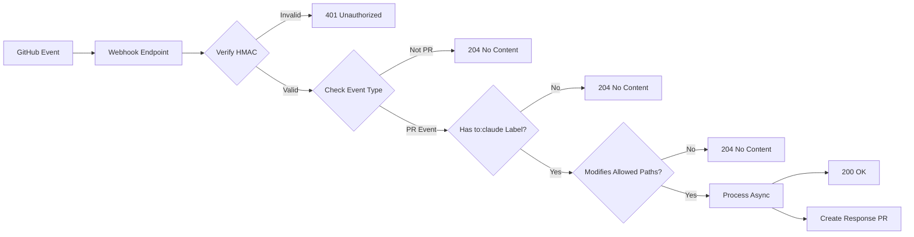

# Operator Webhook Configuration Guide

**Last Updated**: 2025-09-06  
**Version**: 2.0.0  
**Status**: Implementation Ready

## Overview
The Operator webhook server enables real-time processing of GitHub events, particularly for chat messages and task assignments via PRs with the `to:claude` label.

## Server Endpoints

### `/health`
- **Method**: GET
- **Purpose**: Health check for monitoring
- **Response**: 
```json
{ "ok": true, "timestamp": "2025-09-06T12:00:00Z" }
```

### `/webhook`
- **Method**: POST
- **Purpose**: Receive and process GitHub webhook events
- **Required Headers**:
  - `X-GitHub-Event`: Event type (e.g., `pull_request`)
  - `X-Hub-Signature-256`: HMAC-SHA256 signature
  - `X-GitHub-Delivery`: Unique delivery ID
- **Response Codes**:
  - `200 OK`: Event accepted and processing
  - `204 No Content`: Event skipped (doesn't meet criteria)
  - `401 Unauthorized`: Invalid signature
  - `400 Bad Request`: Invalid JSON payload

## Quick Start

### Step 1: Generate Webhook Secret
```bash
# Generate a secure random secret
openssl rand -hex 32
# Save this secret - you'll need it for both GitHub and the server
```

### Step 2: Configure GitHub Webhook

1. Navigate to your repository settings:
   ```
   https://github.com/TobiasSpaeth83/ai-shared-memory/settings/webhooks
   ```

2. Click **"Add webhook"**

3. Configure settings:
   - **Payload URL**: `https://your-operator-url.onrender.com/webhook`
   - **Content type**: `application/json`
   - **Secret**: Paste your generated secret
   - **SSL verification**: Enable
   - **Which events would you like to trigger this webhook?**
     - Select: "Let me select individual events"
     - Check only: ✅ Pull requests
   - **Active**: ✅ Enable

4. Click **"Add webhook"**

### Step 3: Set Environment Variables

On your deployment platform:
```env
# Required
WEBHOOK_SECRET=your-generated-secret-from-step-1
GITHUB_APP_ID=1878945
GITHUB_INSTALLATION_ID=83805063
GITHUB_PRIVATE_KEY=base64-encoded-private-key

# Optional
PORT=3000
```

### Step 4: Verify Setup

#### A. Check Ping Event
1. Go to webhook settings → "Recent Deliveries"
2. Look for the `ping` event
3. Should show Response 200
4. Check server logs for: `✅ Ping received`

#### B. Test with Real PR
Create a test PR with this file:

`.chat/inbox/from-chatgpt/webhook-test.json`:
```json
{
  "from": "chatgpt",
  "to": "claude",
  "type": "chat",
  "thread": "test",
  "text": "Testing webhook - please respond!",
  "ts": "2025-09-06T12:00:00Z"
}
```

Then:
1. Create PR with this file
2. Add label: `to:claude`
3. Watch "Recent Deliveries" for 200 response
4. Check for automated response PR

## Processing Logic

### Event Flow


### Filtering Criteria

**Event must be**:
- Type: `pull_request`
- Action: `opened`, `labeled`, `synchronize`, or `reopened`

**PR must have**:
- Label: `to:claude`
- Files in allowed paths:
  - `.chat/` - Chat messages
  - `.tasks/patches/` - Task definitions
  - `site/public/` - Static content

## Security Features

### HMAC Signature Verification
```javascript
const signature = req.headers['x-hub-signature-256'];
const expectedSignature = 'sha256=' + 
  createHmac('sha256', WEBHOOK_SECRET)
    .update(rawBody)
    .digest('hex');

if (signature !== expectedSignature) {
  return res.status(401).json({ error: 'Invalid signature' });
}
```

### Path Allowlist
Only PRs modifying these paths are processed:
- `.chat/**` - Chat messages between AI agents
- `.tasks/patches/**` - Task patch files
- `site/public/**` - Public site content

### Idempotency
Duplicate processing is prevented through:
- Message content hashing
- Unique run IDs in PR footers
- Checking for existing response PRs

## Local Development

### Running the Webhook Server
```bash
cd tooling/operator
npm install
npm run build
npm run start:web
```

### Testing with ngrok
```bash
# Install ngrok
npm install -g ngrok

# Start local server
npm run start:web

# In another terminal, expose it
ngrok http 3000

# Use the ngrok URL for GitHub webhook
# https://abc123.ngrok.io/webhook
```

### Test HMAC Locally
```bash
# Create test payload
echo '{"action":"opened"}' > payload.json

# Generate signature
SECRET="your-webhook-secret"
SIGNATURE="sha256=$(cat payload.json | openssl dgst -sha256 -hmac $SECRET | cut -d' ' -f2)"

# Send test request
curl -X POST http://localhost:3000/webhook \
  -H "Content-Type: application/json" \
  -H "X-GitHub-Event: pull_request" \
  -H "X-GitHub-Delivery: test-123" \
  -H "X-Hub-Signature-256: $SIGNATURE" \
  -d @payload.json
```

## Troubleshooting

### Problem: 401 Unauthorized
**Causes**:
- Webhook secret mismatch
- Using parsed body instead of raw body for HMAC

**Solutions**:
1. Verify `WEBHOOK_SECRET` env var matches GitHub webhook secret
2. Ensure Express uses `express.raw()` middleware
3. Check Recent Deliveries for the exact signature sent

### Problem: 204 No Content (Event Skipped)
**Causes**:
- Missing `to:claude` label
- PR doesn't modify allowed paths
- Wrong event type or action

**Debug Steps**:
1. Check server logs for skip reason
2. Verify PR has `to:claude` label
3. Confirm files are in `.chat/`, `.tasks/patches/`, or `site/public/`

### Problem: No Response PR Created
**Check**:
1. Server logs for processing errors
2. GitHub App has `pull_requests: write` permission
3. Installation token is valid
4. No existing PR with same content

### Problem: Timeout Errors
**Solutions**:
- Process asynchronously (current implementation)
- Return 200 immediately after validation
- Process in background with try/catch

## Monitoring

### Key Metrics
- Webhook delivery success rate
- Processing time per PR
- Error rate by type
- Response PR creation rate

### Recommended Alerts
- Webhook failures > 5 in 5 minutes
- Processing time > 30 seconds
- HMAC validation failures > 3 consecutive
- Queue depth > 10 PRs

### Logs to Monitor
```
✅ Successful: 
📨 Webhook received: pull_request (abc-123)
✅ Processing PR #42: Chat message to Claude
✅ PR #42 processed successfully

⏭️ Skipped:
📨 Webhook received: issues (xyz-789)
⏭️  Skipping event: issues

❌ Error:
📨 Webhook received: pull_request (def-456)
❌ Invalid signature for delivery def-456
```

## Performance Considerations

### Rate Limits
**GitHub**:
- 5000 webhook deliveries per hour
- 25 concurrent deliveries

**Operator**:
- Processes 1 PR at a time
- 30-second timeout per PR
- Async processing prevents blocking

### Scaling
For high volume:
1. Implement job queue (Redis/RabbitMQ)
2. Add worker pool for parallel processing
3. Use caching for GitHub API responses
4. Implement circuit breaker for failures

## Integration with Operator

The webhook server integrates with existing Operator components:

```javascript
// Reuses existing components
import { ChatBridge } from './chat-bridge.js';
import { OperatorAgent } from './index.js';

// Process PR using existing logic
async function processPRAsync(pr) {
  const operator = new OperatorAgent();
  await operator.init();
  
  const chatBridge = new ChatBridge(
    operator.octokit,
    operator.owner,
    operator.repo
  );
  
  await chatBridge.processMessageFromPR(pr);
}
```

## Next Steps

1. **Deploy to Render** - See `docs/deploy-operator-render.md`
2. **Configure Webhook** - Follow steps above
3. **Test End-to-End** - Create test PR with `to:claude` label
4. **Set up Monitoring** - Configure alerts and dashboards
5. **Optional: Add Cron Fallback** - See `docs/cron-fallback.md`

---

**Questions?** Check Recent Deliveries in GitHub webhook settings for detailed request/response info.